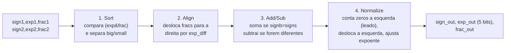
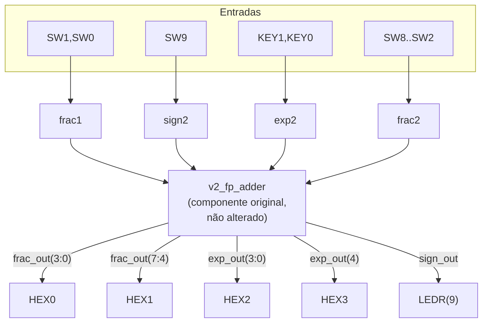

# Somador de Ponto Flutuante em FPGA

Projeto da disciplina **MCTA024 - Sistemas Digitais** (UFABC) — um circuito capaz de somar números binários em formato de ponto flutuante simplificado de 13 bits, adaptado do livro-texto *FPGA Prototyping by VHDL Examples* (Pong P. Chu, seção 3.7.4) para a placa **Terasic DE10-Lite (MAX 10)**.

> **Nota sobre esta reorganização (09/08/2026):** o repositório acumulou várias tentativas (pastas `FPGA REGISTRADO/`, `certo-taina/`, uma versão sequencial em `versao-registrada/`, rascunhos de tutorial de commits antigos). Depois de revisar o histórico de commits, identificamos que os arquivos soltos na raiz do repositório enviados nos dois últimos commits (`v2_fp_adder*.vhd`, `*.qsf`, `*.qpf`, `db/`, `output_files/` com `.sof`/`.pof` já gerados) são a **versão definitiva e mais recente** do projeto — a única com bitstream de gravação já compilado com sucesso. Este README documenta essa versão. Os arquivos de código-fonte e do projeto Quartus foram movidos para as pastas `rtl_original/`, `rtl_de10lite/` e `quartus/` (veja [Estrutura do repositório](#estrutura-do-repositório)); nada binário (imagens, `.sof`/`.pof`, formas de onda) foi movido ou apagado, para não correr risco de corromper essas evidências.

# Tutorial: Implementação de Somador Ponto Flutuante na DE10-Lite

**Autores:** Juliana Tiemi Ito, Taina Cavichia, Lucas Gabriel Cavalheiro Rodrigues

**Disciplina:** Sistemas Digitais Q2.2026

**Data:** 09/08/2026 (última revisão da documentação)

---

*Etapa 1*
## 1. Objetivo do Projeto

Este projeto adapta o somador de ponto flutuante simplificado (13 bits) do livro-texto para a placa Terasic DE10-Lite (MAX 10). O objetivo é comprovar matematicamente o algoritmo em simulação, adaptar o hardware para os periféricos físicos disponíveis na placa e demonstrar a síntese lógica e a gravação real do circuito.

## 2. Descrição gráfica do funcionamento do sistema

### 2.1 Formato de ponto flutuante (13 bits)

| Campo | Sinal VHDL | Tamanho | Significado |
|---|---|---|---|
| Sinal | `sign1`/`sign2` | 1 bit | `0` = positivo, `1` = negativo |
| Expoente | `exp1`/`exp2` | 4 bits | não sinalizado, 0 a 15 |
| Fração (significando) | `frac1`/`frac2` | 8 bits | não sinalizado, MSB deve ser `1` quando normalizado |

Valor representado: **valor = (−1)^sign × 0.frac × 2^exp**

**Exemplo de conversão decimal → normalizado → binário (entrada):**
Suponha que queremos representar o número **20352**.
1. Escrever em ponto flutuante normalizado: 20352 = 0,62109375 × 2¹⁵ (o expoente é escolhido de forma que a mantissa fique entre 0,5 e 1, ou seja, o bit mais significativo da fração seja `1`).
2. Converter 0,62109375 para binário: `0.10011111`.
3. Campos de 13 bits: `sign=0`, `exp="1111"` (15), `frac="10011111"`.
4. Esse é exatamente o tipo de valor "alto" fixado no operando 1 do circuito da placa (veja seção 3).

**Exemplo de conversão binário → decimal (saída):** se `sign_out=0`, `exp_out="10000"` (16) e `frac_out="11111111"`, o valor é 0,99609375 × 2¹⁶ = **65280**. Esse é exatamente o resultado do Caso A da simulação (dois números altos somados geram *carry-out* e o expoente sobe de 15 para 16).

### 2.2 As 4 etapas do circuito (`v2_fp_adder.vhd`)



| Sinal | Estágio | Papel |
|---|---|---|
| `signb, expb, fracb` | 1 (sort) | número de maior magnitude ("big") |
| `signs, exps, fracs` | 1 (sort) | número de menor magnitude ("small") |
| `exp_diff`, `fraca` | 2 (align) | diferença de expoentes e fração do "small" já deslocada |
| `sum` | 3 (add/sub) | resultado bruto de 9 bits (1 bit extra para carry) |
| `leado`, `sum_norm` | 4 (normalize) | zeros à esquerda contados e fração já deslocada |
| `sign_out, exp_out, frac_out` | saída | resultado final normalizado |

## 3. Adaptações de Hardware (DE10-Lite)

### O que o livro original usava x o que mudamos

| Livro-texto (placa genérica) | `v2_fp_adder_de10lite` (nossa placa) | Por quê |
|---|---|---|
| `exp_out` com 4 bits | **`exp_out` com 5 bits** | Bug do livro: se `expb=15` e há carry-out, `expb+1=16` não cabe em 4 bits e estoura silenciosamente. Ampliamos para 5 bits para representar corretamente esse caso (comprovado no Caso A da simulação). |
| 8 chaves + 4 botões, 4 displays multiplexados no tempo (`disp_mux`, sinal `an`) | 10 chaves (`SW`), 2 botões (`KEY`), **6 displays dedicados (HEX0–HEX5)**, sem multiplexação | A DE10-Lite tem um pino físico por segmento em cada display — não precisamos do `disp_mux` nem do sinal `an` que existiam no livro. |
| `exp2` usa 4 bits de botões | `exp2 <= "11" & KEY(1) & KEY(0)` — só 2 bits variáveis (dos 2 botões que a placa tem), 2 bits fixos em `"11"` | A DE10-Lite só tem 2 botões (contra 4 na placa do livro); fixamos os 2 bits mais significativos do expoente para não faltar entrada, reduzindo a faixa de expoentes testável mas preservando todos os casos de normalização. |
| — | `HEX3` mostra apenas o bit mais significativo de `exp_out` (`"000" & exp_out(4)`) | Consequência direta de termos ampliado `exp_out` para 5 bits: precisamos de um display a mais para o bit extra do expoente. |

### Roteamento de operandos (opf1 fixo em valores altos, opf2 variável)

```vhdl
-- operando 1 (opf1): quase todo fixo, em valores altos
sign1 <= '0';
exp1  <= "1111";                         -- expoente máximo (15)
frac1 <= '1' & SW(1) & SW(0) & "11111";  -- só 2 bits variáveis

-- operando 2 (opf2): controlado pelas chaves/botões restantes
sign2 <= SW(9);
exp2  <= "11" & KEY(1) & KEY(0);
frac2 <= '1' & SW(8 downto 2);
```

Fixar o operando 1 em valores altos (expoente máximo, fração quase toda em `1`) é proposital: assim qualquer soma com o operando 2 tende a estourar a fração (testando o *carry-out* do 4º estágio) sem precisar zerar todas as chaves manualmente a cada teste.

### Mapeamento de pinos físicos (DE10-Lite, ver `quartus/de10lite_pin_assignments.csv`)



| Sinal top-level | Pino FPGA | Sinal top-level | Pino FPGA |
|---|---|---|---|
| CLOCK_50 | PIN_P11 | HEX0[0..6] | C14,E15,C15,C16,E16,D17,C17 |
| KEY[0] / KEY[1] | PIN_B8 / PIN_A7 | HEX1[0..6] | C18,D18,E18,B16,A17,A18,B17 |
| SW[0..9] | C10,C11,D12,C12,A12,B12,A13,A14,B14,F15 | HEX2[0..6] | B20,A20,B19,A21,B21,C22,B22 |
| LEDR[0] / LEDR[9] | PIN_A8 / PIN_B11 | HEX3[0..6] | F21,E22,E21,C19,C20,D19,E17 |

Dispositivo: **10M50DAF484C7G** (família MAX 10), família selecionada no Quartus Prime 24.1std.

## 4. Evidências de Validação

### Simulação — os 4 casos exigidos

O testbench (`rtl_original/v2_fp_adder_tb.vhd`) cobre os 3 tipos de normalização descritos no livro-texto mais o caso trivial (soma já normalizada):

| Caso | O que testa | sign1 exp1 frac1 | sign2 exp2 frac2 | sign_out | exp_out | frac_out |
|---|---|---|---|---|---|---|
| **A** | Carry-out na adição (por isso `exp_out` precisou de 5 bits) | 0 1111 11111111 | 0 1111 11111111 | 0 | 10000 | 11111111 |
| **B** | Subtração com zeros à esquerda (desloca e conta corretamente) | 0 0101 10100000 | 1 0101 10010000 | 0 | 00010 | 10000000 |
| **C** | Resultado pequeno demais → vira zero (underflow) | 0 0001 10000000 | 1 0001 10000000 | — | 00000 | 00000000 |
| **D** | Soma já normalizada, sem deslocamento e sem carry-out | 0 1111 10000000 | 0 1110 10000000 | 0 | 01111 | 11000000 |

> **Ação pendente do grupo:** rodar `ghdl -a/-e/-r` sobre `rtl_original/v2_fp_adder.vhd` + `rtl_original/v2_fp_adder_tb.vhd`, abrir o `.ghw` no GTKWave, conferir os 4 casos acima na régua de tempo (20 ns por caso) e colar aqui o print com os 4 blocos visíveis. Fazer o mesmo no Questa (`simulation/questa/`) para atender ao critério de "Simulação no Questa validada".

```
<!-- Print das formas de onda (GTKWave e/ou Questa) com os 4 casos -->
<!--  -->
```

### Código VHDL final — trechos adaptados em destaque

```vhdl
-- rtl_original/v2_fp_adder.vhd (núcleo matemático, NÃO alterado em relação
-- ao livro, exceto pela largura de exp_out — ver abaixo)
signal expn : unsigned(4 downto 0);   -- <<< ampliado de 4 para 5 bits
...
exp_out : out std_logic_vector(4 downto 0);  -- <<< idem
...
if sum(8) = '1' then
    expn <= resize(expb, expn'length) + 1;   -- <<< resize evita overflow
    fracn <= sum(8 downto 1);
```

```vhdl
-- rtl_de10lite/v2_fp_adder_de10lite.vhd (top-level, camada de adaptação
-- física — o componente v2_fp_adder é reaproveitado sem alterações)
sign1 <= '0';
exp1  <= "1111";                         -- <<< opf1 fixo em valor alto
frac1 <= '1' & SW(1) & SW(0) & "11111";  -- <<< só 2 bits variáveis
...
hex3_unit: hex_to_sseg port map (hex => "000" & exp_out(4), sseg => HEX3); -- <<< display extra p/ o bit 4 do expoente
```

### Funcionamento na Placa

Resumo do relatório do Fitter (`output_files/v2_fp_adder_de10lite.fit.summary`), evidência de que o projeto compilou com sucesso para o dispositivo alvo:

```
Fitter Status : Successful
Device : 10M50DAF484C7G (MAX 10)
Total logic elements : 123 / 49.760 (<1%)
Total registers : 0 (projeto puramente combinacional)
Total pins : 50 / 360 (14%)
```

O arquivo de gravação `output_files/v2_fp_adder_de10lite.sof` já foi gerado (permanece na raiz do repositório como evidência histórica da primeira compilação bem-sucedida).

> **Ação pendente do grupo:** gravar a placa (`Tools → Programmer`, `.sof` acima) e fotografar os 4 casos da tabela da seção anterior reproduzidos fisicamente nas chaves/botões, com os HEX0–HEX3 e o LEDR(9) visíveis.

```
<!-- Fotos da placa DE10-Lite funcionando, para os 4 casos -->
<!--  -->
```

## 5. Diário de Bordo de IA

### Sessão registrada nesta reorganização (Claude, via Cowork)

**Ferramenta:** Claude (Anthropic), modo Cowork, com acesso de leitura/escrita ao repositório GitHub via conector.

**Prompt utilizado (resumo fiel do pedido original em português coloquial):**
> "Preciso fazer uma documentação baseada no projeto [link do GitHub]... os últimos arquivos enviados, ignora os antigos, seria o projeto todo nele, com o opf1 fixo em valores altos e opf2, tem como organizar as pastas e deixar os arquivos com '2 days ago' separados numa pasta que seria o projeto definitivo" + a rubrica de avaliação completa colada na mensagem.

**O que a IA fez:** leu o PDF da disciplina e o capítulo do livro-texto enviados, navegou todo o histórico de commits do repositório (via API do GitHub) para identificar, pela data de cada commit, qual conjunto de arquivos era a versão "de 2 dias atrás" (a mais recente) e qual era rascunho antigo/tentativa abandonada de outro integrante; comparou o `v2_fp_adder.vhd` com o algoritmo original do livro e identificou que o campo `exp_out` foi ampliado de 4 para 5 bits (correção de um overflow silencioso do design original); moveu os arquivos-fonte de texto (`.vhd`, `.qsf`, `.qpf`, `.csv`) para uma estrutura de pastas limpa; adicionou um 4º caso de teste ao testbench, que só tinha 3; reescreveu este README seguindo o template da professora.

**Onde a correção humana ainda é necessária (a IA não pode fazer isto):** a IA não tem como rodar o GHDL/GTKWave/Questa nem gravar a placa física — os prints de simulação e as fotos da placa (marcados como "ação pendente" nas seções 4) precisam ser feitos e conferidos por vocês. A IA também não decidiu sozinha o que descartar: as perguntas sobre qual versão documentar (`v2_fp_adder` vs. `versao-registrada`) e se o repositório deveria ser reorganizado de fato foram respondidas pelo grupo antes de qualquer alteração ser feita, e as mudanças foram enviadas em uma branch separada (`reorganizacao-projeto-definitivo`) com Pull Request, exatamente para que o grupo revise antes de aceitar.

**Quanto ajudou:** acelerou bastante a arqueologia do histórico do Git (achar o que era "definitivo" entre ~150 arquivos e 30 commits de 3 pessoas diferentes seria lento manualmente) e a redação do relatório técnico. A responsabilidade de conferir cada afirmação técnica, rodar as simulações reais e validar na placa continua 100% do grupo.

### Sessões anteriores (preencher pelo grupo)

> Se vocês já usaram ChatGPT/Gemini/Claude em outras etapas (ex.: geração do testbench original, do `hex_to_sseg.vhd`, do guia `Tutorial_Somador_Ponto_Flutuante_FPGA.md`), documentem aqui: qual ferramenta, qual prompt, o que ela errou (se errou) e como vocês corrigiram.

| Ferramenta | O que foi pedido | Erro/alucinação encontrado | Correção humana |
|---|---|---|---|
| _(preencher)_ | | | |

## 6. Contribuição dos participantes

Sugestão de distribuição usando a Taxonomia CRediT, baseada na atividade observada no histórico de commits do repositório — **ajustem conforme a divisão real de trabalho do grupo**:

- **Juliana Tiemi Ito** — Administração do projeto, Curadoria de dados, Desenvolvimento de software (testbenches, script de validação cruzada em Python), Validação, Redação (documentação e README).
- **Taina Cavichia** — Desenvolvimento de software (upload da versão final do projeto Quartus: `v2_fp_adder`, arquivos de síntese), Recursos, Supervisão.
- **Lucas Gabriel Cavalheiro Rodrigues** — Desenvolvimento de software (configuração de driver USB-Blaster para gravação em Linux, exploração inicial de hardware), Validação.

Taxonomia de referência: https://credit.niso.org/

## Estrutura do repositório

```
.
├── README.md                          <- este tutorial (entrega da Etapa 4)
├── rtl_original/                      <- Etapa 1: núcleo matemático (não alterado, exceto exp_out)
│   ├── v2_fp_adder.vhd
│   └── v2_fp_adder_tb.vhd             <- testbench com os 4 casos exigidos
├── rtl_de10lite/                      <- Etapa 2: adaptação para a placa
│   ├── v2_fp_adder_de10lite.vhd       <- top-level (SW/KEY -> HEX/LEDR)
│   └── hex_to_sseg.vhd
├── quartus/                           <- Etapa 3: projeto Quartus (fonte)
│   ├── v2_fp_adder_de10lite.qpf
│   ├── v2_fp_adder_de10lite.qsf
│   └── de10lite_pin_assignments.csv
├── output_files/                      <- evidência: .sof/.pof e relatórios já gerados (primeira compilação bem-sucedida, 07/08/2026)
├── simulation/questa/                 <- evidência: saída de simulação Questa
├── onda.ghw, GTKWave33.png, "RESUMO: N PASS 0 FAIL.png"  <- evidências de simulação GHDL/GTKWave
├── documentacao_simulacao_de10lite.pdf
├── Tutorial_Somador_Ponto_Flutuante_FPGA.md   <- guia complementar (instalação de ferramentas, passo a passo)
├── db/, incremental_db/, *.bak, work-obj93.cf <- cache interno do Quartus/GHDL (regenerado automaticamente ao recompilar; não precisa mexer)
└── legado/ (não versão definitiva — mantidos apenas para histórico, não usar como referência)
    ├── FPGA REGISTRADO/, certo-taina/     <- tentativas anteriores de outro integrante
    └── versao-registrada/                 <- versão alternativa (sequencial/com clock), não adotada como final
```

> As pastas listadas em "legado" **não foram fisicamente movidas** nesta reorganização (para não arriscar corromper os arquivos binários que contêm — PDFs, bitstreams, imagens). Elas continuam nos mesmos caminhos do repositório; esta tabela serve apenas para deixar claro que não fazem parte do projeto definitivo.

## Checklist final

- [x] `v2_fp_adder.vhd` identificado como núcleo original, com a correção de largura de `exp_out` (4→5 bits) documentada
- [x] Testbench com os 4 casos exigidos (carry-out, deslocamento, underflow, soma trivial) — `rtl_original/v2_fp_adder_tb.vhd`
- [x] Mapeamento de pinos SW/KEY/HEX/LEDR documentado e justificado
- [x] Projeto Quartus organizado em `quartus/`, com dispositivo `10M50DAF484C7G`
- [x] Evidência de compilação bem-sucedida (`output_files/*.fit.summary`)
- [ ] Print do GTKWave/Questa com os 4 casos (pendente — ação do grupo)
- [ ] Fotos da placa gravada e testada fisicamente para os 4 casos (pendente — ação do grupo)
- [ ] Diário de Bordo de IA das sessões anteriores preenchido pelo grupo
- [x] Taxonomia CRediT (sugestão inicial — grupo deve validar)
- [ ] Repositório marcado como **Privado** no GitHub (o roteiro da disciplina pede repositório privado; hoje ele está público)
- [ ] Link final enviado no Moodle
