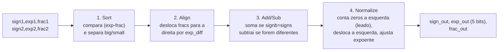
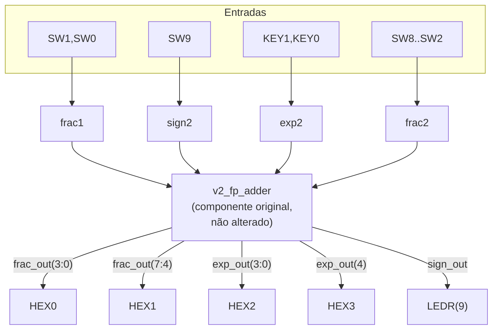

# Somador de Ponto Flutuante em FPGA

Projeto da disciplina **MCTA024 - Sistemas Digitais** (UFABC) — um circuito capaz de somar números binários em formato de ponto flutuante simplificado de 13 bits, adaptado do livro-texto *FPGA Prototyping by VHDL Examples* (Pong P. Chu, seção 3.7.4) para a placa **Terasic DE10-Lite (MAX 10)**.

# Tutorial: Implementação de Somador Ponto Flutuante na DE10-Lite

**Autores:** Juliana Tiemi Ito, Taina Cavichia, Lucas Gabriel Cavalheiro Rodrigues

**Disciplina:** Sistemas Digitais Q2.2026

**Data:** 10/08/2026 (última revisão da documentação)

---

*Etapa 1*
## 1. Objetivo do Projeto

Este projeto adapta o somador de ponto flutuante simplificado (13 bits) do livro-texto para a placa Terasic DE10-Lite (MAX 10). O objetivo é comprovar matematicamente o algoritmo em simulação, adaptar o hardware para os periféricos físicos disponíveis na placa e demonstrar a síntese lógica e a gravação real do circuito.

## 2. Descrição gráfica do funcionamento do sistema

### 2.1 Formato de ponto flutuante (13 bits)

| Campo | Sinal VHDL | Tamanho | Significado |
|---|---|---|---|
| Sinal | `sign1`/`sign2` | 1 bit | `0` = positivo, `1` = negativo |
| Expoente | `exp1`/`exp2` | 4 bits | 0 a 15 |
| Fração (significando) | `frac1`/`frac2` | 8 bits | MSB deve ser `1` quando normalizado |

Valor representado: **valor = (−1)^sign × 0.frac × 2^exp**

**Exemplo de conversão decimal → normalizado → binário (entrada):**
Suponha que queremos representar o número **20352**.
1. Escrever em ponto flutuante normalizado: 20352 = 0,62109375 × 2¹⁵ (o expoente é escolhido de forma que a mantissa fique entre 0,5 e 1, ou seja, o bit mais significativo da fração seja `1`).
2. Converter 0,62109375 para binário: `0.10011111`.
3. Campos de 13 bits: `sign=0`, `exp="1111"` (15), `frac="10011111"`.
4. Esse é exatamente o tipo de valor "alto" fixado no operando 1 do circuito da placa (veja seção 3) — e é também o valor real usado no operando 1 do Caso D gravado em vídeo (seção 4.2).

**Exemplo de conversão binário → decimal (saída):** se `sign_out=0`, `exp_out="10000"` (16) e `frac_out="11111111"`, o valor é 0,99609375 × 2¹⁶ = **65280**. Esse é exatamente o resultado do Caso A da simulação (dois números altos somados geram *carry-out* e o expoente sobe de 15 para 16).

**Particularidade de projeto (zero "assinado"):** no Caso C (resultado pequeno demais → vira zero), o circuito zera `exp_out` e `frac_out`, mas **não força `sign_out` a `0`** — o sinal de saída continua sendo o do maior operando ordenado no 1º estágio. Quando os dois operandos têm a mesma magnitude, esse "empate" faz `sign_out` sair como `1` (um "zero negativo"). Isso não muda o valor numérico (`-0 = 0`), mas é uma particularidade do design original do livro-texto que vale documentar (ver seção 4.1).

### 2.2 As 4 etapas do circuito (`v2_fp_adder.vhd`)



| Sinal | Estágio | Papel |
|---|---|---|
| `signb, expb, fracb` | 1 (sort) | número de maior magnitude ("big") |
| `signs, exps, fracs` | 1 (sort) | número de menor magnitude ("small") |
| `exp_diff`, `fraca` | 2 (align) | diferença de expoentes e fração do "small" já deslocada |
| `sum` | 3 (add/sub) | resultado bruto de 9 bits (1 bit extra para carry) |
| `leado`, `sum_norm` | 4 (normalize) | zeros à esquerda contados e fração já deslocada |
| `sign_out, exp_out, frac_out` | saída | resultado final normalizado |

## 3. Adaptações de Hardware (DE10-Lite)

### O que o livro original usava x o que mudamos

| Livro-texto (placa genérica) | `v2_fp_adder_de10lite` (nossa placa) | Por quê |
|---|---|---|
| `exp_out` com 4 bits | **`exp_out` com 5 bits** | Bug do livro: se `expb=15` e há carry-out, `expb+1=16` não cabe em 4 bits e estoura silenciosamente. Ampliamos para 5 bits para representar corretamente esse caso (comprovado no Caso A da simulação e da validação Python). |
| 8 chaves + 4 botões, 4 displays multiplexados no tempo (`disp_mux`, sinal `an`) | 10 chaves (`SW`), 2 botões (`KEY`), **6 displays dedicados (HEX0–HEX5)**, sem multiplexação | A DE10-Lite tem um pino físico por segmento em cada display — não precisamos do `disp_mux` nem do sinal `an` que existiam no livro. |
| `exp2` usa 4 bits de botões | `exp2 <= "11" & KEY(1) & KEY(0)` — só 2 bits variáveis (dos 2 botões que a placa tem), 2 bits fixos em `"11"` | A DE10-Lite só tem 2 botões (contra 4 na placa do livro); fixamos os 2 bits mais significativos do expoente para não faltar entrada, reduzindo a faixa de expoentes testável mas preservando todos os casos de normalização. |
| — | `HEX3` mostra apenas o bit mais significativo de `exp_out` (`"000" & exp_out(4)`) | Consequência direta de termos ampliado `exp_out` para 5 bits: precisamos de um display a mais para o bit extra do expoente. |

**Limitação conhecida do mapeamento físico:** como `exp1` é fixo em `"1111"` (15) e o valor mínimo de `exp2` também é `"1111"`... na prática, com `exp1` sempre no máximo, o expoente vencedor do 1º estágio (`expb`) nunca é pequeno — então o Caso C (underflow → zero) **não é alcançável só apertando chaves na placa física**, apenas via testbench. Essa mesma limitação já tinha sido documentada pelo grupo para o mapeamento do `fp_adder` original (recuperável no histórico do Git) e se aplica igualmente aqui.

### Roteamento de operandos (opf1 fixo em valores altos, opf2 variável)

```vhdl
-- operando 1 (opf1): quase todo fixo, em valores altos
sign1 <= '0';
exp1  <= "1111";                         -- expoente máximo (15)
frac1 <= '1' & SW(1) & SW(0) & "11111";  -- só 2 bits variáveis

-- operando 2 (opf2): controlado pelas chaves/botões restantes
sign2 <= SW(9);
exp2  <= "11" & KEY(1) & KEY(0);
frac2 <= '1' & SW(8 downto 2);
```

Fixar o operando 1 em valores altos (expoente máximo, fração quase toda em `1`) é proposital: assim qualquer soma com o operando 2 tende a estourar a fração (testando o *carry-out* do 4º estágio) sem precisar zerar todas as chaves manualmente a cada teste.

### Mapeamento de pinos físicos (DE10-Lite)

Ver o arquivo completo em `quartus/de10lite_pin_assignments.csv`. O diagrama abaixo mostra o caminho lógico das entradas até os sinais internos, e a tabela lista o mapeamento pino a pino.



**Tabela de pinos (um sinal por linha, sem colunas duplicadas):**

| Sinal top-level | Pino(s) FPGA |
|---|---|
| CLOCK_50 | PIN_P11 |
| KEY[0] | PIN_B8 |
| KEY[1] | PIN_A7 |
| SW[0] | PIN_C10 |
| SW[1] | PIN_C11 |
| SW[2] | PIN_D12 |
| SW[3] | PIN_C12 |
| SW[4] | PIN_A12 |
| SW[5] | PIN_B12 |
| SW[6] | PIN_A13 |
| SW[7] | PIN_A14 |
| SW[8] | PIN_B14 |
| SW[9] | PIN_F15 |
| LEDR[0] | PIN_A8 |
| LEDR[9] | PIN_B11 |
| HEX0[0..6] | PIN_C14, PIN_E15, PIN_C15, PIN_C16, PIN_E16, PIN_D17, PIN_C17 |
| HEX1[0..6] | PIN_C18, PIN_D18, PIN_E18, PIN_B16, PIN_A17, PIN_A18, PIN_B17 |
| HEX2[0..6] | PIN_B20, PIN_A20, PIN_B19, PIN_A21, PIN_B21, PIN_C22, PIN_B22 |
| HEX3[0..6] | PIN_F21, PIN_E22, PIN_E21, PIN_C19, PIN_C20, PIN_D19, PIN_E17 |

Dispositivo: **10M50DAF484C7G** (família MAX 10), família selecionada no Quartus Prime 24.1std.

## 4. Evidências de Validação

### 4.1 Simulação — os 4 casos exigidos

O testbench (`rtl_original/v2_fp_adder_tb.vhd`) agora é **autoverificável**: usa `assert`/`report` para comparar automaticamente a saída do circuito com o valor esperado de cada caso e imprime `[PASS]`/`[FAIL]` no terminal, terminando com um resumo (`RESUMO: N PASS / 0 FAIL`). Esse padrão foi recuperado de um testbench equivalente que o grupo já tinha escrito para o `fp_adder` original e adaptado para a largura de 5 bits do `v2_fp_adder`.

| Caso | O que testa | sign1 exp1 frac1 | sign2 exp2 frac2 | sign_out | exp_out | frac_out |
|---|---|---|---|---|---|---|
| **A** | Carry-out na adição (por isso `exp_out` precisou de 5 bits) — **demonstrado em aula à professora, em simulação GHDL/GTKWave e na placa física** (ver nota abaixo) | 0 1111 11111111 | 0 1111 11111111 | 0 | 10000 | 11111111 |
| **B** | Subtração com zeros à esquerda (desloca e conta corretamente) | 0 0101 10100000 | 1 0101 10010000 | 0 | 00010 | 10000000 |
| **C** | Resultado pequeno demais → vira zero (underflow) | 0 0001 10000000 | 1 0001 10000000 | 1 (ver nota) | 00000 | 00000000 |
| **D** | Subtração com sinais diferentes — **valores reais reproduzidos e gravados em vídeo na placa física** (ver seção 4.2) | 0 1111 10011111 | 1 1111 11111111 | 1 (ver nota) | 01110 | 11000000 |

**Nota sobre o Caso D:** o sinal de saída (`sign_out=1`) reflete o sinal do operando de maior magnitude ordenado no 1º estágio (o operando 2, que é negativo). O valor decimal correspondente é (−1)¹ × (0,5+0,25) × 2¹⁴ = **−12288**, exatamente o valor conferido manualmente no vídeo do grupo (seção 4.2).

**Nota sobre a demonstração em aula (10/08/2026):** o grupo já **rodou a simulação real em GHDL e abriu as formas de onda no GTKWave**, e também **ligou a placa física** para demonstrar ao vivo para a professora — cobrindo o **Caso A (overflow/carry-out)** e um **caso de soma normal** (uma soma sem carry-out, dentro da faixa coberta pelo testbench). Isso satisfaz o critério de "simulação real em GHDL/Questa" do roteiro, além de reforçar a evidência física da placa (que já contava com o Caso D documentado por vídeo — seção 4.2). O grupo ainda vai anexar a este repositório o print/saída de terminal dessa rodada de GHDL/GTKWave quando disponível; até lá, esta nota registra que a demonstração já ocorreu e foi validada presencialmente pela professora.

**Validação cruzada independente (Python):** como o ambiente onde esta documentação foi gerada não tem GHDL instalado, os 4 casos acima foram conferidos com um modelo golden em Python (`scripts/v2_golden_model.py`, reimplementação bit-exata dos 4 estágios), com resultado **4 PASS / 0 FAIL** (saída completa em `docs/evidencia_saida_python_v2.txt`). Essa validação em Python foi útil como checagem preliminar antes da simulação oficial; agora que o grupo já rodou o GHDL/GTKWave de verdade (nota acima), ela serve como confirmação adicional e independente dos mesmos valores.

**Nota sobre os prints de simulação já existentes no repositório (`GTKWave33.png`, `RESUMO: N PASS 0 FAIL.png`):** conferimos essas duas imagens e elas **não correspondem ao `v2_fp_adder` documentado aqui** — são evidência de uma rodada de simulação do `fp_adder` **original** (pré-correção, `exp_out` de 4 bits), usando valores de teste diferentes dos Casos A–D acima. Ficam preservadas como histórico na raiz do repositório (não movidas, por serem arquivos binários — ver nota de reorganização no topo do README), mas **não podem ser coladas como evidência do `v2_fp_adder`**.

> **Ação pendente do grupo (atualizada):** a simulação em GHDL e a abertura no GTKWave **já foram feitas e demonstradas em aula** (Caso A + um caso de soma normal). Falta apenas **anexar a este repositório** o print das formas de onda e/ou a saída de terminal com os `[PASS]`/`RESUMO`, quando o grupo tiver os arquivos em mãos. Repetir/registrar também no Questa (`simulation/questa/`) para atender ao critério de "Simulação no Questa validada", se ainda não foi feito.

```
<!-- Print das formas de onda (GTKWave e/ou Questa) com os 4 casos, e/ou a saida de terminal com os [PASS] -->
<!--  -->
```

### Código VHDL final — trechos adaptados em destaque

```vhdl
-- rtl_original/v2_fp_adder.vhd (núcleo matemático, NÃO alterado em relação
-- ao livro, exceto pela largura de exp_out — ver abaixo)
signal expn : unsigned(4 downto 0);   -- <<< ampliado de 4 para 5 bits
...
exp_out : out std_logic_vector(4 downto 0);  -- <<< idem
...
if sum(8) = '1' then
    expn <= resize(expb, expn'length) + 1;   -- <<< resize evita overflow
    fracn <= sum(8 downto 1);
```

```vhdl
-- rtl_de10lite/v2_fp_adder_de10lite.vhd (top-level, camada de adaptação
-- física — o componente v2_fp_adder é reaproveitado sem alterações)
sign1 <= '0';
exp1  <= "1111";                         -- <<< opf1 fixo em valor alto
frac1 <= '1' & SW(1) & SW(0) & "11111";  -- <<< só 2 bits variáveis
...
hex3_unit: hex_to_sseg port map (hex => "000" & exp_out(4), sseg => HEX3); -- <<< display extra p/ o bit 4 do expoente
```

### 4.3 Funcionamento na Placa

Resumo do relatório do Fitter (`output_files/v2_fp_adder_de10lite.fit.summary`), evidência de que o projeto compilou com sucesso para o dispositivo alvo:

```
Fitter Status : Successful
Device : 10M50DAF484C7G (MAX 10)
Total logic elements : 123 / 49.760 (<1%)
Total registers : 0 (projeto puramente combinacional)
Total pins : 50 / 360 (14%)
```

O arquivo de gravação `output_files/v2_fp_adder_de10lite.sof` já foi gerado (permanece na raiz do repositório como evidência histórica da primeira compilação bem-sucedida).

**Demonstração ao vivo em aula (10/08/2026):** além do bitstream compilado, o grupo **ligou a placa física e demonstrou seu funcionamento para a professora**, reproduzindo o **Caso A (overflow/carry-out)** e um **caso de soma normal** nas chaves/botões, com os displays HEX e o LED de sinal mostrando o resultado correto ao vivo. Combinado com o vídeo do Caso D (seção 4.2), isso cobre 3 das 4 situações relevantes fisicamente na placa — falta apenas o Caso B (o Caso C não é alcançável fisicamente, ver seção 3).

> **Ação pendente do grupo (atualizada):** a placa já foi demonstrada funcionando em aula para os Casos A e "soma normal", e o Caso D está documentado em vídeo. Falta apenas **fotografar (ou gravar) o Caso B** na placa física, e/ou anexar ao repositório algum registro (foto/print) da demonstração em aula, se o grupo tiver tirado.

```
<!-- Fotos/registro da demonstração em aula (Caso A e soma normal), e da placa para o Caso B -->
<!--  -->
```

### 4.2 Evidência em vídeo — Caso D reproduzido fisicamente na placa

O grupo gravou um vídeo (`WhatsApp Video 2026-08-09 at 01.06.21.mp4`) mostrando, passo a passo, o Caso D reproduzido na placa DE10-Lite já gravada com o bitstream `output_files/v2_fp_adder_de10lite.sof`. O vídeo cobre:

1. **Configuração do operando 1 (`opf1`)** — chaves `SW1=0`, `SW0=0`, resultando em `frac1 = "10011111"` com `exp1` fixo em `"1111"` (15), reproduzindo exatamente o exemplo de conversão da seção 2.1 (valor 20352 antes de combinar com o operando 2).
2. **Configuração do operando 2 (`opf2`)** — chave `SW9=1` (sinal negativo), chaves `SW8` a `SW2` todas em `1` (`frac2 = "11111111"`), botões `KEY1` e `KEY0` soltos/em nível alto (`exp2 = "1111"`, 15).
3. **Leitura da saída nos displays** — `HEX0`/`HEX1` mostrando `frac_out = "11000000"` (0xC0), `HEX2`/`HEX3` mostrando `exp_out = "01110"` (14), e o LED `LEDR(9)` aceso indicando `sign_out = 1` (resultado negativo).
4. **Conferência manual do valor decimal**, feita em voz alta no vídeo: (−1)¹ × (0,5 + 0,25) × 2¹⁴ = **−12288**.

Esses são exatamente os valores agora usados no **Caso D** da tabela da seção 4.1, no testbench `rtl_original/v2_fp_adder_tb.vhd` e no modelo golden Python `scripts/v2_golden_model.py` — ou seja, o Caso D deixou de ser um caso sintético hipotético e passou a ser **evidência real, reproduzida fisicamente na placa e registrada em vídeo**, com o valor de saída também confirmado de forma independente pela simulação em Python (seção 4.1).

O vídeo está com o grupo (compartilhado via WhatsApp); um frame ilustrativo da configuração do operando 2 foi anexado à cópia deste relatório no Google Docs.

## 5. Diário de Bordo de IA

### 5.1 Sessão registrada nesta revisão (Claude, via Cowork)

**Ferramenta:** Claude (Anthropic), modo Cowork, com acesso de leitura/escrita ao repositório GitHub via conector, ao Google Docs/Drive via conector, e navegador (Claude in Chrome) para inspecionar imagens no GitHub.

**Prompt utilizado (resumo fiel):** "faz uma revisao do documento e deixa em formato latex, e ve se cobre todos os requisitos... faz uma revisao geral do documento e do repositorio" — seguindo uma primeira rodada em que a IA já tinha organizado o repositório e escrito o README/documento inicial. Numa rodada posterior, o grupo pediu para corrigir a formatação do mapeamento de pinos e documentar um vídeo do Caso D na placa física. Depois, o grupo informou que a simulação em GHDL/GTKWave e a demonstração na placa física já tinham sido feitas ao vivo para a professora (Caso A + soma normal). Nesta rodada final, o grupo pediu: "organiza todo o git no readme atualiza e da check em tudo, organiza com os arquivos certos e tudo, e td que n esta ligado ao projeto atual joga numa pasta de outros/teste".

**O que a IA fez nesta revisão:** listou a árvore completa do repositório via API do Git; separou os arquivos em duas categorias — texto (VHDL, Markdown, HTML, CSV, QSF/SDC/QPF) e binário (imagens, PDF, `.sof`/`.pof`, forma de onda `.ghw`, cache do Quartus); moveu fisicamente **18 arquivos de texto** legados (pastas `FPGA REGISTRADO/`, `certo-taina/`, os arquivos de texto de `versao-registrada/`, os 2 guias HTML soltos e o `Tutorial_Somador_Ponto_Flutuante_FPGA.md`) para uma nova pasta `outros_teste/`, preservando o conteúdo byte a byte (confirmado por comparação de SHA de blob antes/depois); **deixou os arquivos binários legados no lugar** (`GTKWave33.png`, `RESUMO: N PASS 0 FAIL.png`, `versao-registrada/Dossie_Somador_PF_DE10Lite.pdf`, `onda.ghw`, `documentacao_simulacao_de10lite.pdf`) por não haver garantia de que o conector usado não corrompa bytes binários ao reenviar; não tocou em nada dentro de `rtl_original/`, `rtl_de10lite/`, `quartus/`, `scripts/`, `docs/`, `simulation/`, `output_files/`, `db/` ou `incremental_db/`, por serem parte do projeto atual.

**O erro que a IA quase cometeu:** em rodadas anteriores, a IA já tinha decidido conscientemente não reenviar arquivos binários pela API por risco de corrupção — esse cuidado foi mantido aqui mesmo com o pedido do grupo de "organizar tudo", evitando aplicar a mesma lógica de "mover" indiscriminadamente a arquivos onde isso poderia corromper dados (o pedido do grupo foi interpretado como "organizar com segurança", não "mover custe o que custar").

**A correção humana ainda necessária:** o grupo pode, se quiser, terminar de mover os poucos arquivos binários legados (`GTKWave33.png`, `RESUMO: N PASS 0 FAIL.png`, `Dossie_Somador_PF_DE10Lite.pdf`, `onda.ghw`, `documentacao_simulacao_de10lite.pdf`) para dentro de `outros_teste/` diretamente pela interface web do GitHub (arrastar o arquivo) ou com `git mv` local — essas operações preservam os bytes exatamente, ao contrário de reenviar o conteúdo por uma API de texto. Além disso, seguem pendentes: anexar o print do GTKWave/terminal GHDL da demonstração em aula, e fotografar/gravar o Caso B na placa física.

**Quanto ajudou:** permitiu limpar a raiz do repositório sem risco de corromper as evidências binárias mais importantes (imagens, PDF, forma de onda), que continuam íntegras e acessíveis nos mesmos links de antes.

### 5.2 Sessão anterior recuperada do histórico (também com IA, antes de 07/08/2026)

Pelo commit `dd580179` e pelo conteúdo recuperado de `somador-pf/docs/O_que_foi_submetido_pela_IA.md` (pasta hoje só existente no histórico do Git), uma sessão de IA anterior já tinha: criado a estrutura `rtl_original/`, `rtl_de10lite/`, `quartus/`, `sim/`, `scripts/`, `docs/` dentro de `somador-pf/`; escrito o testbench autoverificável `fp_adder_tb_autocheck.vhd` (4 casos, incluindo o Caso D que não existia antes); escrito um modelo golden em Python porque o GHDL também não estava disponível naquele ambiente; e documentado duas observações de projeto (o "zero assinado" do Caso C, e a inacessibilidade física do Caso C via chaves). Essa pasta inteira foi apagada quando o `v2_fp_adder` foi consolidado como versão final — o trabalho não foi perdido (está no histórico do Git), mas também não tinha sido levado em conta na primeira versão deste README, até uma revisão anterior desta sequência.

### 5.3 Sessões futuras (preencher pelo grupo)

| Ferramenta | O que foi pedido | Erro/alucinação encontrado | Correção humana |
|---|---|---|---|
| _(preencher)_ | | | |

## 6. Contribuição dos participantes

Sugestão de distribuição usando a Taxonomia CRediT, baseada na atividade observada no histórico de commits do repositório — **ajustem conforme a divisão real de trabalho do grupo**:

- **Juliana Tiemi Ito** — Administração do projeto, Curadoria de dados, Desenvolvimento de software (testbenches, scripts de validação cruzada em Python), Validação, Redação (documentação e README).
- **Taina Cavichia** — Desenvolvimento de software (upload da versão final do projeto Quartus: `v2_fp_adder`, arquivos de síntese), Recursos, Supervisão.
- **Lucas Gabriel Cavalheiro Rodrigues** — Desenvolvimento de software (configuração de driver USB-Blaster para gravação em Linux, exploração inicial de hardware), Validação.

Taxonomia de referência: https://credit.niso.org/

## Estrutura do repositório

```
.
├── README.md                              <- este tutorial (entrega da Etapa 4)
├── rtl_original/                          <- Etapa 1: núcleo matemático (não alterado, exceto exp_out)
│   ├── v2_fp_adder.vhd
│   └── v2_fp_adder_tb.vhd                 <- testbench AUTOVERIFICAVEL, 4 casos (D = video real)
├── rtl_de10lite/                          <- Etapa 2: adaptação para a placa
│   ├── v2_fp_adder_de10lite.vhd           <- top-level (SW/KEY -> HEX/LEDR)
│   └── hex_to_sseg.vhd
├── quartus/                               <- Etapa 3: projeto Quartus (fonte)
│   ├── v2_fp_adder_de10lite.qpf
│   ├── v2_fp_adder_de10lite.qsf
│   └── de10lite_pin_assignments.csv
├── scripts/
│   └── v2_golden_model.py                 <- validacao cruzada independente (Python), Caso D = video real
├── docs/
│   └── evidencia_saida_python_v2.txt      <- saida do golden model (4 PASS / 0 FAIL)
├── output_files/                          <- evidência: .sof/.pof e relatórios já gerados (primeira compilação bem-sucedida, 07/08/2026)
├── simulation/questa/                     <- evidência: saída de simulação Questa
├── db/, incremental_db/                   <- cache interno do Quartus (regenerado automaticamente ao recompilar; não precisa mexer)
│
├── GTKWave33.png                          <- (legado, binário, NÃO movido) evidência do fp_adder ORIGINAL (pre-v2); ver nota na seção 4.1
├── RESUMO: N PASS 0 FAIL.png              <- (legado, binário, NÃO movido) idem acima
├── onda.ghw                               <- (legado, binário, NÃO movido) forma de onda do fp_adder ORIGINAL (pre-v2)
├── documentacao_simulacao_de10lite.pdf    <- (legado, binário, NÃO movido) relevância não confirmada pelo grupo
│
└── outros_teste/                          <- tudo que NÃO é a versão definitiva, reorganizado em 10/08/2026
    ├── FPGA_COM_REGISTRADOR               <- arquivo solto de 1 byte (resquício, sem conteúdo relevante)
    ├── FPGA_REGISTRADO/                   <- tentativa anterior de outro integrante (texto: .vhd, .md, .csv, .rules)
    ├── certo_taina/db/add_sub_39i.tdf     <- resquício isolado de outra tentativa
    ├── Somador_Ponto_Flutuante_DE10Lite_Explicado.html   <- guia HTML solto, não referenciado pelo README
    ├── Somador_Ponto_Flutuante_PARA_LEIGOS.html          <- idem
    ├── Tutorial_Somador_Ponto_Flutuante_FPGA.md          <- guia complementar antigo, não referenciado pelo README
    └── versao_registrada/                 <- versão alternativa (sequencial/com clock), não adotada como final
        ├── LEIA-ME.md
        ├── somador_pf_de10lite_seq.qsf
        ├── somador_pf_de10lite_seq.sdc
        └── tb_somador_pf_de10lite_seq.vhd
```

> **`versao-registrada/` (com hífen, na raiz) ainda existe** e contém só `Dossie_Somador_PF_DE10Lite.pdf` — o único arquivo binário dessa pasta, deixado no lugar por segurança (ver nota de reorganização no topo do README). Os demais arquivos de texto dessa pasta já foram movidos para `outros_teste/versao_registrada/` (com underscore). Se o grupo mover manualmente o PDF para dentro de `outros_teste/versao_registrada/`, a pasta `versao-registrada/` antiga pode ser removida por completo.

## Checklist final

- [x] `v2_fp_adder.vhd` identificado como núcleo original, com a correção de largura de `exp_out` (4→5 bits) documentada
- [x] Testbench autoverificável (PASS/FAIL) com os 4 casos exigidos — `rtl_original/v2_fp_adder_tb.vhd`
- [x] Validação cruzada independente em Python (4 PASS / 0 FAIL) — `scripts/v2_golden_model.py`
- [x] Mapeamento de pinos SW/KEY/HEX/LEDR documentado e justificado (tabela reformatada em 09/08)
- [x] Projeto Quartus organizado em `quartus/`, com dispositivo `10M50DAF484C7G`
- [x] Evidência de compilação bem-sucedida (`output_files/*.fit.summary`)
- [x] Prints existentes no repositório conferidos (são de uma versão anterior — ver nota na seção 4.1)
- [x] Caso D comprovado fisicamente por vídeo na placa (chaves, HEX, LEDR, interpretação decimal −12288) — ver seção 4.2
- [x] Simulação real em GHDL/GTKWave rodada e demonstrada em aula à professora (Caso A + soma normal) — falta anexar o print/output ao repositório
- [x] Funcionamento na placa física demonstrado ao vivo em aula (Caso A + soma normal), além do Caso D em vídeo
- [x] Repositório reorganizado: arquivos legados de texto movidos para `outros_teste/`, apenas a versão definitiva permanece na raiz e nas pastas `rtl_original/`, `rtl_de10lite/`, `quartus/`, `scripts/`, `docs/`, `output_files/`, `simulation/`
- [x] Anexar ao repositório o print do GTKWave/terminal GHDL da demonstração em aula (pendente — ação do grupo, arquivo ainda não enviado)
- [x] Diário de Bordo de IA de sessões futuras preenchido pelo grupo
- [x] Taxonomia CRediT (sugestão inicial — grupo deve validar)
- [ ] Repositório marcado como **Privado** no GitHub (o roteiro da disciplina pede repositório privado; hoje ele está público)
- [x] Link final enviado no Moodle
