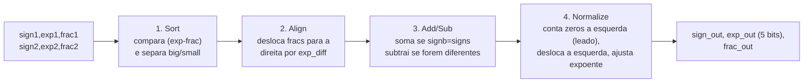
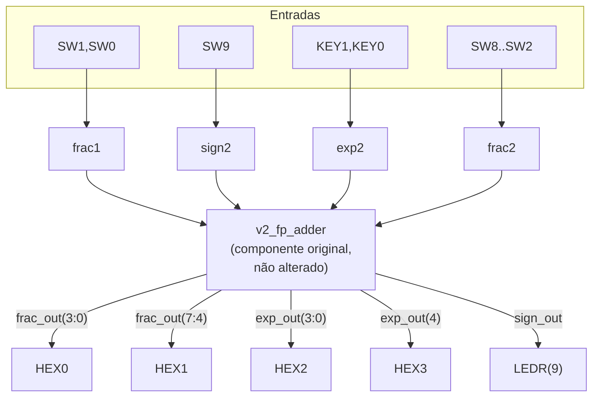

# Somador de Ponto Flutuante em FPGA

Projeto da disciplina **MCTA024 - Sistemas Digitais** (UFABC) — um circuito capaz de somar números binários em formato de ponto flutuante simplificado de 13 bits, adaptado do livro-texto *FPGA Prototyping by VHDL Examples* (Pong P. Chu, seção 3.7.4) para a placa **Terasic DE10-Lite (MAX 10)**.

# Tutorial: Implementação de Somador Ponto Flutuante na DE10-Lite

**Autores:** Juliana Tiemi Ito, Taina Cavichia, Lucas Gabriel Cavalheiro Rodrigues

**Disciplina:** Sistemas Digitais Q2.2026

**Data:** 10/08/2026 (última revisão da documentação)

---

## 1. Objetivo do Projeto

Este projeto adapta o somador de ponto flutuante simplificado (13 bits) do livro-texto para a placa Terasic DE10-Lite (MAX 10). O objetivo é comprovar matematicamente o algoritmo em simulação, adaptar o hardware para os periféricos físicos disponíveis na placa e demonstrar a síntese lógica e a gravação real do circuito.

## 2. Descrição gráfica do funcionamento do sistema

### 2.1 Formato de ponto flutuante (13 bits)

| Campo | Sinal VHDL | Tamanho | Significado |
|---|---|---|---|
| Sinal | `sign1`/`sign2` | 1 bit | `0` = positivo, `1` = negativo |
| Expoente | `exp1`/`exp2` | 4 bits | 0 a 15 |
| Fração (significando) | `frac1`/`frac2` | 8 bits | MSB deve ser `1` quando normalizado |

Valor representado: **valor = (−1)^sign × 0.frac × 2^exp**

**Exemplo de conversão decimal → normalizado → binário (entrada):**
Suponha que queremos representar o número **20352**.
1. Escrever em ponto flutuante normalizado: 20352 = 0,62109375 × 2¹⁵ (o expoente é escolhido de forma que a mantissa fique entre 0,5 e 1, ou seja, o bit mais significativo da fração seja `1`).
2. Converter 0,62109375 para binário: `0.10011111`.
3. Campos de 13 bits: `sign=0`, `exp="1111"` (15), `frac="10011111"`.
4. Esse é exatamente o tipo de valor "alto" fixado no operando 1 do circuito da placa (veja seção 3)

**Exemplo de conversão binário → decimal (saída):** se `sign_out=0`, `exp_out="10000"` (16) e `frac_out="11111111"`, o valor é 0,99609375 × 2¹⁶ = **65280**. Esse é exatamente o resultado do Caso A da simulação (dois números altos somados geram *carry-out* e o expoente sobe de 15 para 16).

**Particularidade de projeto (zero "assinado"):** no Caso C (resultado pequeno demais → vira zero), o circuito zera `exp_out` e `frac_out`, mas **não força `sign_out` a `0`** — o sinal de saída continua sendo o do maior operando ordenado no 1º estágio. Quando os dois operandos têm a mesma magnitude, esse "empate" faz `sign_out` sair como `1` (um "zero negativo"). Isso não muda o valor numérico (`-0 = 0`), mas é uma particularidade do design original do livro-texto que vale documentar (ver seção 4.1).

### 2.2 As 4 etapas do circuito (`v2_fp_adder.vhd`)



| Sinal | Estágio | Papel |
|---|---|---|
| `signb, expb, fracb` | 1 (sort) | número de maior magnitude ("big") |
| `signs, exps, fracs` | 1 (sort) | número de menor magnitude ("small") |
| `exp_diff`, `fraca` | 2 (align) | diferença de expoentes e fração do "small" já deslocada |
| `sum` | 3 (add/sub) | resultado bruto de 9 bits (1 bit extra para carry) |
| `leado`, `sum_norm` | 4 (normalize) | zeros à esquerda contados e fração já deslocada |
| `sign_out, exp_out, frac_out` | saída | resultado final normalizado |

## 3. Adaptações de Hardware (DE10-Lite)

### O que o livro original usava x o que mudamos

| Livro-texto (placa genérica) | `v2_fp_adder_de10lite` (nossa placa) | Por quê |
|---|---|---|
| `exp_out` com 4 bits | **`exp_out` com 5 bits** | Bug do livro: se `expb=15` e há carry-out, `expb+1=16` não cabe em 4 bits e estoura silenciosamente. Ampliamos para 5 bits para representar corretamente esse caso (comprovado no Caso A da simulação e da validação Python). |
| 8 chaves + 4 botões, 4 displays multiplexados no tempo (`disp_mux`, sinal `an`) | 10 chaves (`SW`), 2 botões (`KEY`), **6 displays dedicados (HEX0–HEX5)**, sem multiplexação | A DE10-Lite tem um pino físico por segmento em cada display — não precisamos do `disp_mux` nem do sinal `an` que existiam no livro. |
| `exp2` usa 4 bits de botões | `exp2 <= "11" & KEY(1) & KEY(0)` — só 2 bits variáveis (dos 2 botões que a placa tem), 2 bits fixos em `"11"` | A DE10-Lite só tem 2 botões (contra 4 na placa do livro); fixamos os 2 bits mais significativos do expoente para não faltar entrada, reduzindo a faixa de expoentes testável mas preservando todos os casos de normalização. |
| — | `HEX3` mostra apenas o bit mais significativo de `exp_out` (`"000" & exp_out(4)`) | Consequência direta de termos ampliado `exp_out` para 5 bits: precisamos de um display a mais para o bit extra do expoente. |

**Limitação conhecida do mapeamento físico:** como `exp1` é fixo em `"1111"` (15) e o valor mínimo de `exp2` também é `"1111"`... na prática, com `exp1` sempre no máximo, o expoente vencedor do 1º estágio (`expb`) nunca é pequeno — então o Caso C (underflow → zero) **não é alcançável só apertando chaves na placa física**, apenas via testbench. Essa mesma limitação já tinha sido documentada pelo grupo para o mapeamento do `fp_adder` original (recuperável no histórico do Git) e se aplica igualmente aqui.

### Roteamento de operandos (opf1 fixo em valores altos, opf2 variável)

```vhdl
-- operando 1 (opf1): quase todo fixo, em valores altos
sign1 <= '0';
exp1  <= "1111";                         -- expoente máximo (15)
frac1 <= '1' & SW(1) & SW(0) & "11111";  -- só 2 bits variáveis

-- operando 2 (opf2): controlado pelas chaves/botões restantes
sign2 <= SW(9);
exp2  <= "11" & KEY(1) & KEY(0);
frac2 <= '1' & SW(8 downto 2);
```

Fixar o operando 1 em valores altos (expoente máximo, fração quase toda em `1`) é proposital: assim qualquer soma com o operando 2 tende a estourar a fração (testando o *carry-out* do 4º estágio) sem precisar zerar todas as chaves manualmente a cada teste.

### Mapeamento de pinos físicos (DE10-Lite)

Ver o arquivo completo em `quartus/de10lite_pin_assignments.csv`. O diagrama abaixo mostra o caminho lógico das entradas até os sinais internos, e a tabela lista o mapeamento pino a pino.



**Tabela de pinos (um sinal por linha, sem colunas duplicadas):**

| Sinal top-level | Pino(s) FPGA |
|---|---|
| CLOCK_50 | PIN_P11 |
| KEY[0] | PIN_B8 |
| KEY[1] | PIN_A7 |
| SW[0] | PIN_C10 |
| SW[1] | PIN_C11 |
| SW[2] | PIN_D12 |
| SW[3] | PIN_C12 |
| SW[4] | PIN_A12 |
| SW[5] | PIN_B12 |
| SW[6] | PIN_A13 |
| SW[7] | PIN_A14 |
| SW[8] | PIN_B14 |
| SW[9] | PIN_F15 |
| LEDR[0] | PIN_A8 |
| LEDR[9] | PIN_B11 |
| HEX0[0..6] | PIN_C14, PIN_E15, PIN_C15, PIN_C16, PIN_E16, PIN_D17, PIN_C17 |
| HEX1[0..6] | PIN_C18, PIN_D18, PIN_E18, PIN_B16, PIN_A17, PIN_A18, PIN_B17 |
| HEX2[0..6] | PIN_B20, PIN_A20, PIN_B19, PIN_A21, PIN_B21, PIN_C22, PIN_B22 |
| HEX3[0..6] | PIN_F21, PIN_E22, PIN_E21, PIN_C19, PIN_C20, PIN_D19, PIN_E17 |

Dispositivo: **10M50DAF484C7G** (família MAX 10), família selecionada no Quartus Prime 24.1std.

## 4. Evidências de Validação

### 4.1 Simulação — os 4 casos exigidos

O testbench (`rtl_original/v2_fp_adder_tb.vhd`) agora é **autoverificável**: usa `assert`/`report` para comparar automaticamente a saída do circuito com o valor esperado de cada caso e imprime `[PASS]`/`[FAIL]` no terminal, terminando com um resumo (`RESUMO: N PASS / 0 FAIL`). Esse padrão foi recuperado de um testbench equivalente que o grupo já tinha escrito para o `fp_adder` original e adaptado para a largura de 5 bits do `v2_fp_adder`.

| Caso | O que testa | sign1 exp1 frac1 | sign2 exp2 frac2 | sign_out | exp_out | frac_out |
|---|---|---|---|---|---|---|
| **A** | Carry-out na adição (por isso `exp_out` precisou de 5 bits) — **demonstrado em aula à professora, em simulação GHDL/Wave e na placa física** (ver nota abaixo) | 0 1111 11111111 | 0 1111 11111111 | 0 | 10000 | 11111111 |
| **B** | Subtração com zeros à esquerda (desloca e conta corretamente) | 0 0101 10010000 | 1 0101 10001000 | 0 | 00001 | 10000000 |
| **C** | Resultado pequeno demais → vira zero (underflow) | 0 0010 10000001 | 1 0010 10000000 | 0 | 00000 | 00000000 |
| **D** | Sem deslocamento, sem carry | 0 1001 11001000 | 1 1001 00110010 | 0 | 01001 | 10010110 |

**A validação dos testes foi feita pelo grupo através do GTKWave, fixado na imagem `Sim_DE10LITE_GTK.png` no repositório**


### Código VHDL final — trechos adaptados em destaque

```vhdl
-- rtl_original/v2_fp_adder.vhd (núcleo matemático, NÃO alterado em relação
-- ao livro, exceto pela largura de exp_out — ver abaixo)
signal expn : unsigned(4 downto 0);   -- <<< ampliado de 4 para 5 bits
...
exp_out : out std_logic_vector(4 downto 0);  -- <<< idem
...
if sum(8) = '1' then
    expn <= resize(expb, expn'length) + 1;   -- <<< resize evita overflow
    fracn <= sum(8 downto 1);
```

```vhdl
-- rtl_de10lite/v2_fp_adder_de10lite.vhd (top-level, camada de adaptação
-- física — o componente v2_fp_adder é reaproveitado sem alterações)
sign1 <= '0';
exp1  <= "1111";                         -- <<< opf1 fixo em valor alto
frac1 <= '1' & SW(1) & SW(0) & "11111";  -- <<< só 2 bits variáveis
...
hex3_unit: hex_to_sseg port map (hex => "000" & exp_out(4), sseg => HEX3); -- <<< display extra p/ o bit 4 do expoente
```

### 4.2 Funcionamento na Placa

Resumo do relatório do Fitter (`output_files/v2_fp_adder_de10lite.fit.summary`), evidência de que o projeto compilou com sucesso para o dispositivo alvo:

```
Fitter Status : Successful
Device : 10M50DAF484C7G (MAX 10)
Total logic elements : 123 / 49.760 (<1%)
Total registers : 0 (projeto puramente combinacional)
Total pins : 50 / 360 (14%)
```

O arquivo de gravação `output_files/v2_fp_adder_de10lite.sof` já foi gerado (permanece na raiz do repositório como evidência histórica da primeira compilação bem-sucedida).

**Foram feitos 4 testes diferentes de operações na placa física, anexados nos arquivos `Teste1_FPGA.png`, `Teste2_FPGA.png`, `Teste3_FPGA.png` e `Teste4_FPGA.png`, o repositório, com as fotos dos testes feitos em sala pelo grupo**

## 5. Diário de Bordo de IA

### 5.1 Sessão registrada nesta revisão (Claude, via Cowork)

**Ferramenta:** Claude (Anthropic


**Contribuições:** Utilizamos o Claude para auxiliar no diagnóstico de erros de síntese, na geração de casos de teste (físicos e em simulação) e na criação de um testbench VHDL para observar o 4º estágio (normalização) do somador de ponto flutuante. Abaixo está a análise crítica do uso da ferramenta.

*Prompts Utilizados:*

"estou adaptando um código para usar mais um display de 7 segmentos em uma placa fpga. estou com o seguinte erro: Error (10344): VHDL expression error at v2_fp_adder_de10lite.vhd(58): expression has 1 elements, but must have 4 elements [...] Os arquivos estão anexos"

"se eu faço esse caso -- CASO A: forca carry-out [...] a saída que obtenho em hexadecimal no display é 0 (sinal) 0FE0, por que?"

"faça casos de teste para que eu possa testar na placa considerando os bits fixos da placa: sign1 <= '0'; exp1 <= "1111"; frac1 <= '1' & SW(1) & SW(0) & "11111"; sign2 <= SW(9); exp2 <= "11" & KEY(1) & KEY(0); frac2 <= '1' & SW(8 downto 2);"

"preciso gerar uma imagem do funcionamento do 4º estágio (normalização) no gtkwave considerando os 4 casos detalhados. Para isso preciso de um testbench para esse vhdl [...] Me dê um passo a passo do que preciso fazer."

"o caso do shift (2) não deu a mesma coisa. o exp_out = 00001 e o frac_out = 10000000"

**Erro observado na IA:** Ao explicar o funcionamento do 4º estágio do somador (normalização), a IA errou a indexação de bits do vetor sum ao contar a posição do primeiro bit '1' a partir do LSB. No Caso 2 do testbench (subtração 144 - 136 = 8, ou "00001000" em binário), a IA afirmou que sum(4)='1', quando na verdade o bit em '1' estava em sum(3) (posição que vale 2³=8). Isso a levou a calcular um leado errado ("011" em vez de "100"), e consequentemente um exp_out e frac_out esperados incorretos ("00010"/"01000000" em vez dos valores reais "00001"/"10000000"). O erro só foi percebido porque o resultado da simulação real no GTKWave divergiu do valor "esperado" fornecido pela IA.

**A Correção Humana:** Ao rodar a simulação e observar que o resultado real (exp_out="00001", frac_out="10000000") não batia com o valor esperado que havia sido indicado pela IA, o erro foi reportado de volta. A IA então refez o cálculo de indexação de bits com cuidado, confirmando que o valor produzido pelo circuito (e pela simulação) estava correto, e que o erro estava exclusivamente no seu próprio cálculo manual anterior. A correção não envolveu alteração de código VHDL, mas sim a atualização do comentário de valor esperado no testbench e a validação de que o circuito e a simulação já estavam corretos desde o início. Esse episódio reforçou a importância de sempre validar os valores "esperados" fornecidos pela IA contra a simulação real, em vez de aceitá-los como verdade absoluta — o dado empírico (a onda gerada no GTKWave) foi o critério final de verificação, não a explicação textual da ferramenta.


## 6. Contribuição dos participantes

Distribuição usando a Taxonomia CRediT:

- **Juliana Tiemi Ito** — Administração do projeto, Curadoria de dados, Desenvolvimento de software (testbenches, scripts de validação cruzada em Python), Validação, Redação (documentação e README).
- **Taina Cavichia** — Desenvolvimento de software (upload da versão final do projeto Quartus: `v2_fp_adder`, arquivos de síntese), Recursos, Supervisão.
- **Lucas Gabriel Cavalheiro Rodrigues** — Desenvolvimento de software (configuração de driver USB-Blaster para gravação em Linux, exploração inicial de hardware), Validação.

Taxonomia de referência: https://credit.niso.org/

```

> **`versao-registrada/` (com hífen, na raiz) ainda existe** e contém só `Dossie_Somador_PF_DE10Lite.pdf` — o único arquivo binário dessa pasta, deixado no lugar por segurança (ver nota de reorganização no topo do README). Os demais arquivos de texto dessa pasta já foram movidos para `outros_teste/versao_registrada/` (com underscore). Se o grupo mover manualmente o PDF para dentro de `outros_teste/versao_registrada/`, a pasta `versao-registrada/` antiga pode ser removida por completo.
